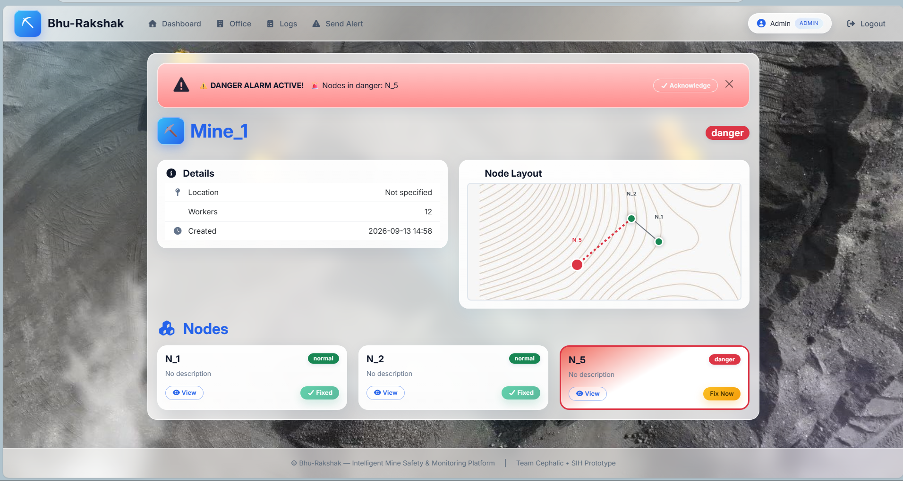
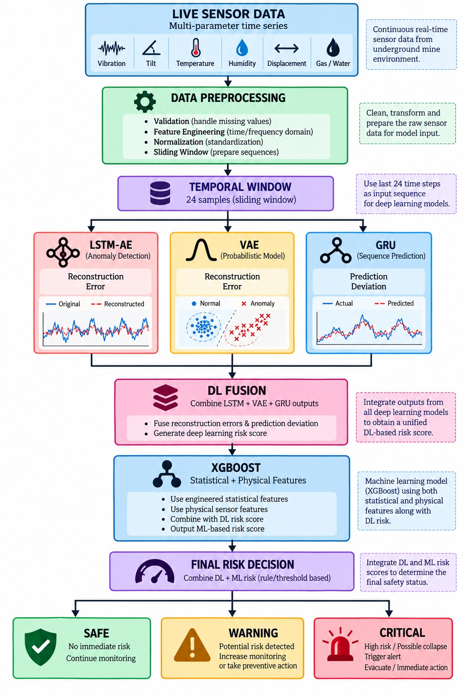
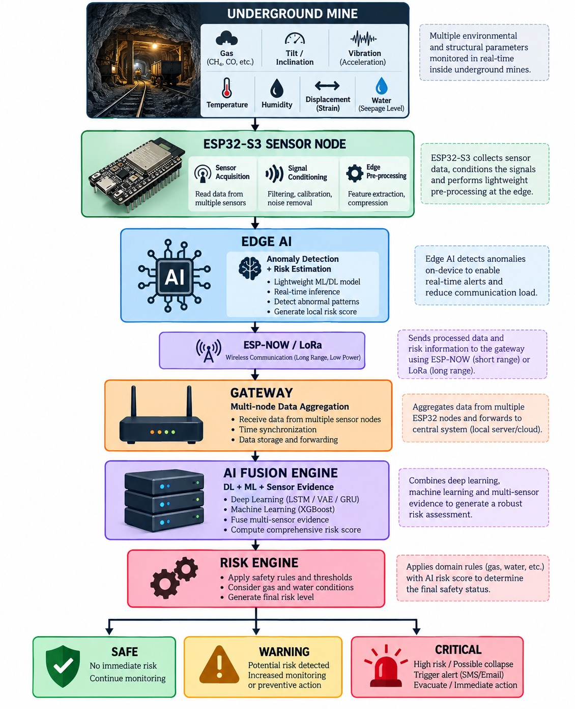
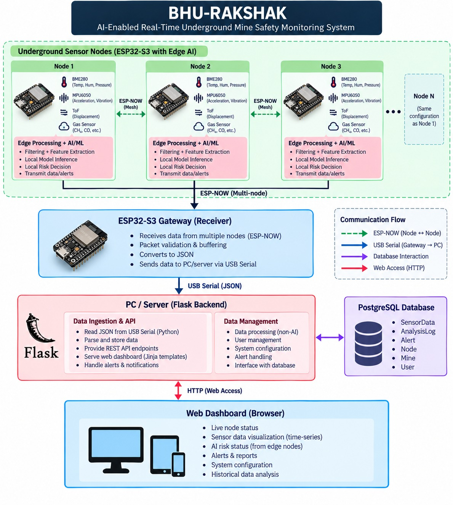
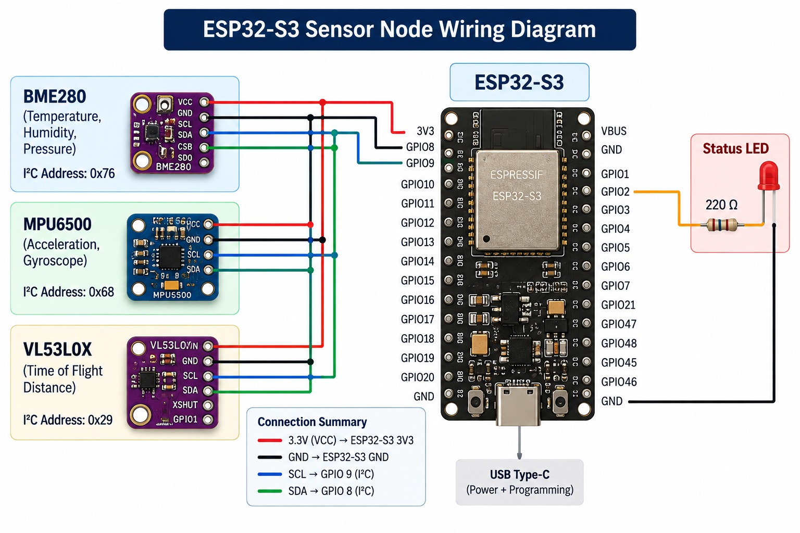
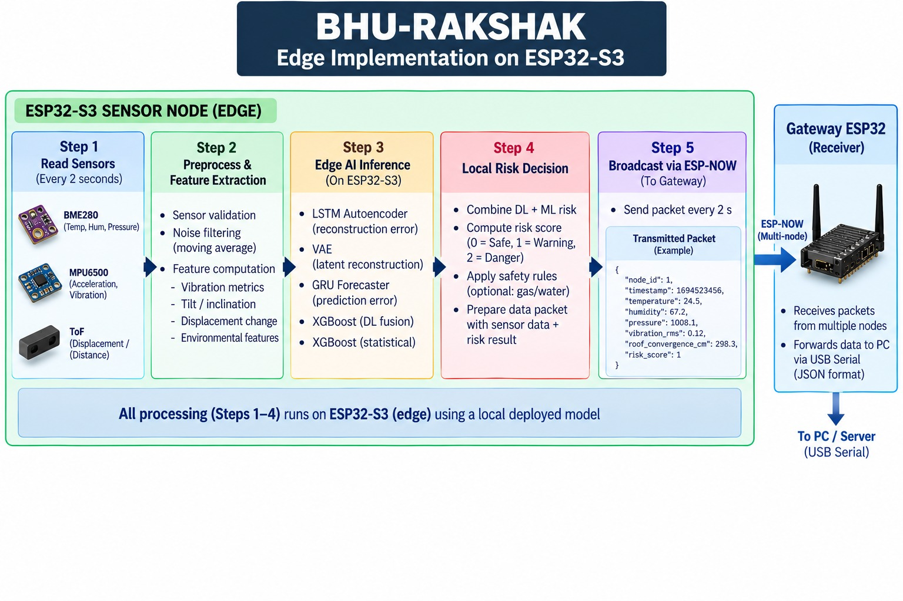

<div align="center">

# 🛡️ Bhu-Rakshak

### Intelligent Mine Safety & Monitoring Platform

**Real-time structural subsidence detection for underground coal mines using Edge AI, ESP-NOW sensor networks, and a full-stack web dashboard.**

[](https://www.python.org/)
[](https://flask.palletsprojects.com/)
[](https://www.postgresql.org/)
[](https://www.tensorflow.org/)
[](https://www.espressif.com/)
[](LICENSE)

*Team Cephalic — Smart India Hackathon 2026*

</div>

---

## 📑 Table of Contents

- [Problem Statement](#problem-statement)
- [Our Solution](#our-solution)
- [Key Features](#key-features)
- [System Architecture](#system-architecture)
- [Data Flow Pipeline](#data-flow-pipeline)
- [AI/ML Engine](#aiml-engine)
- [Technology Stack](#technology-stack)
- [Hardware Setup](#hardware-setup)
- [Software Setup](#software-setup)
- [Project Structure](#project-structure)
- [API Reference](#api-reference)
- [Security Features](#security-features)
- [Team](#team)
- [Acknowledgments](#acknowledgments)

---

## Problem Statement

Underground coal mining remains one of the most hazardous occupations in India.

- **Over 300 fatalities per year** in Indian coal mines (DGMS reports).
- **Roof collapse and subsidence** account for nearly **40% of all mine accidents**.
- Traditional monitoring relies on **manual inspection** at fixed intervals — too slow to catch sudden structural failures.
- Existing sensor systems send data to a **central cloud**, which introduces **latency** and **single points of failure** — deadly in an emergency.
- No unified platform exists to **visualize live sensor data, predict structural anomalies, and alert personnel** in real time.

### The Gap

There is a critical need for a **low-latency, locally-intelligent, and network-independent** mine monitoring system that can detect early signs of subsidence **before** a collapse occurs.

---

## Our Solution

**Bhu-Rakshak** is a complete end-to-end safety platform that:

1. **Deploys ESP32-S3 sensor nodes** throughout the mine, measuring:
   - Roof convergence (Time-of-Flight distance sensor)
   - Structural tilt (MPU6500 gyroscope)
   - Ground vibration (MPU6500 accelerometer)
   - Temperature and humidity (BME280)

2. **Communicates wirelessly via ESP-NOW** — a peer-to-peer protocol that works **without Wi-Fi infrastructure**, ideal for underground mines.

3. **Runs Edge AI inference** (LSTM Autoencoder + VAE + GRU + XGBoost fusion) to classify each node as **SAFE**, **WARNING**, or **CRITICAL**.

4. **Persists data to PostgreSQL** through a Flask backend.

5. **Visualizes the entire mine** on a web dashboard with:
   - Live node status indicators
   - Historical sensor charts
   - AI anomaly metrics
   - Real-time topology map of node connections

6. **Triggers instant alerts** (visual, audible, and email) whenever danger is detected.

> **Core Innovation:** The AI runs at the **edge** (on or near the sensor nodes), not in the cloud. This eliminates network latency and keeps the system operational even when external connectivity is lost — a life-saving advantage in an emergency.

---

## Key Features

| Feature | Description |
|---------|-------------|
| 🎯 **Multi-Model Anomaly Detection** | LSTM Autoencoder + VAE + GRU Forecaster + Dual XGBoost fusion |
| 📡 **ESP-NOW Wireless Network** | Works without Wi-Fi routers or internet — zero latency |
| 🗺️ **Interactive Mine Topology** | Clickable map showing every node and its connections |
| ⚡ **Live Sensor Dashboard** | Auto-refreshing charts with customizable time ranges (5 min to 5 days) |
| 🚨 **Multi-Channel Alerts** | Manual and automatic alerts with email + audio + visual banner |
| 👥 **Role-Based Access Control** | Distinct dashboards for Admin, Engineer, Supervisor |
| 📊 **AI Subsidence Monitor** | Dedicated panel showing LSTM MSE, GRU error, XGBoost probabilities |
| 📈 **CSV Export** | Download filtered sensor and analysis history |
| 📧 **Automated Email Reports** | Manual report generation to selected mines and recipients |
| 🔒 **Security Hardened** | CSRF protection, rate-limited login, password hashing, session security |
| 🎨 **Modern Glassmorphism UI** | Premium look with frosted-glass cards and animated background |





---

## System Architecture




---

## Data Flow Pipeline


---

## AI/ML Engine

Bhu-Rakshak uses a **dual-track ensemble** for maximum robustness:

### Deep Learning Track
| Model | Purpose | Output |
|-------|---------|--------|
| **LSTM Autoencoder** | Detect temporal anomalies in the 24-tick sensor window | Reconstruction MSE |
| **Variational Autoencoder (VAE)** | Capture latent distribution shifts | Latent MSE |
| **GRU Forecaster** | Predict next-frame kinematics; compare to actual | Trajectory error |
| **XGBoost (DL Fusion)** | Meta-learner combining the three DL outputs | DL risk score (0/1/2) |

### Machine Learning Track
| Model | Purpose | Output |
|-------|---------|--------|
| **XGBoost (Statistical)** | Sliding-window statistical features (mean, std, max) | ML risk score (0/1/2) |

### Decision Matrix
```
if ML_risk == 2        → CRITICAL (danger)
elif DL_risk == 1 and ML_risk == 1 → CRITICAL
elif DL_risk == 1 or ML_risk == 1  → WARNING (attention)
else                   → SAFE (normal)
```

All four models are loaded once at startup and run inference **every 5 seconds per active node**.

---

## Technology Stack

### Backend
- **Python 3.11+**
- **Flask 3.x** — web framework
- **Flask-Login** — session management
- **Flask-WTF** — CSRF protection
- **Flask-Limiter** — rate limiting
- **Flask-Mail** — SMTP email delivery
- **SQLAlchemy ORM** — database abstraction
- **PostgreSQL 15+** — production database

### AI/ML
- **TensorFlow / Keras 2.x** — LSTM, VAE, GRU
- **XGBoost** — fusion & statistical classifiers
- **scikit-learn** — scalers, preprocessing
- **NumPy, Pandas** — data manipulation
- **Matplotlib, Seaborn** — dashboard rendering

### Frontend
- **Jinja2** — server-side templating
- **Bootstrap 5.3** — responsive UI
- **Chart.js** — interactive time-series charts
- **Font Awesome 6** — icons
- **Vanilla JavaScript** — AJAX polling, dynamic updates
- **Custom CSS** — glassmorphism theme

### Hardware
- **ESP32-S3** — main microcontroller (dual-core, 240 MHz)
- **BME280** — temperature, humidity, pressure
- **MPU6500** — 6-axis accelerometer + gyroscope
- **VL53L0X / VL53L1X** — ToF(Time of flight) distance sensor for roof convergence
- **ESP-NOW protocol** — peer-to-peer 2.4 GHz wireless
- **IR-Sensor** - for detecting the fire.
- **MQ-4** - detect the Methane (CNG) gas
- **MQ-7** - detect the carbon monoxide (CO) gas
- **MQ-135** - detect the gases like ammonia, benzene, sulfur, carbon dioxide, smoke, and other harmful gases
- **Piezo Electric Sensor** - detecting the acoustic waves
- **Ultrasonic Sensor** - for measuring the node-to-node distance.

### Hardware Programming
- **Arduino IDE** — for compiling and flashing firmware to the ESP32-S3 
  sensor nodes and the ESP32 gateway and Edge deployment

### DevOps
- **Git / GitHub** — version control
- **python-dotenv** — environment configuration


---

## Hardware Setup

### Sensor Node (ESP32-S3)




### Gateway ESP32

- Same ESP32 (or ESP32-S3)
- Connected to a laptop/PC via USB
- Receives ESP-NOW packets, prints JSON to serial



---


## Custom AI
```
models/
├── lstm_autoencoder_final.keras
├── anomaly_metadata.pkl
├── vae_final.keras
├── vae_metadata.pkl
├── gru_forecaster.keras
├── gru_metadata.pkl
├── xgboost_production_ensemble.json
└── xgboost_statistical_detector_2.0.json
```


## Project Structure

```
Team-Cephalic/
│
├── app/
│   ├── __init__.py              # App factory
│   ├── extensions.py            # CSRF, Limiter instances
│   ├── models.py                # SQLAlchemy models
│   ├── ml_engine.py             # AI background thread
│   ├── serial_bridge.py         # USB serial reader
│   ├── notifications.py         # Email delivery
│   ├── scheduler.py             # APScheduler (optional)
│   │
│   ├── routes/
│   │   ├── auth.py              # Login / logout
│   │   ├── main.py              # Dashboard / node detail
│   │   ├── admin.py             # Admin office
│   │   ├── user.py              # Engineer / supervisor
│   │   ├── api.py               # Sensor / analysis API
│   │   └── api_ml.py            # Live AI telemetry
│   │
│   ├── templates/
│   │   ├── base.html
│   │   ├── dashboard.html
│   │   ├── mine_detail.html
│   │   ├── node_detail.html
│   │   ├── office.html
│   │   └── ...
│   │
│   └── static/
│       ├── css/
│       ├── js/
│       ├── img/
│       └── sounds/
│
├── models/                      # AI model artifacts
├── instance/                    # SQLite (dev) database
├── scripts/                     # Backup / utility scripts
├── logs/                        # Application logs
├── config.py                    # Flask configuration
├── run.py                       # Application entry point
├── requirements.txt
├── .env                         # Secrets (gitignored)
├── .gitignore
└── README.md
```

---

## API Reference

### Public Endpoints (Authentication Required)

| Method | Endpoint | Description |
|--------|----------|-------------|
| `GET` | `/` | Main dashboard |
| `GET` | `/mine/<id>` | Mine details with node topology |
| `GET` | `/node/<id>` | Node detail with live sensor charts |
| `GET` | `/logs` | Shift assignment logs |
| `GET` | `/alert/send` | Manual alert form |

### Data Endpoints

| Method | Endpoint | Description |
|--------|----------|-------------|
| `GET` | `/api/node/<id>/sensor-data?range=1h` | Filtered sensor readings |
| `GET` | `/api/node/<id>/analysis?range=1h` | Analysis history |
| `GET` | `/api/node/<id>/sensor-data/download` | CSV export |
| `GET` | `/api/node/<id>/analysis/download` | CSV export |
| `GET` | `/api/ml/live-status?node_id=1` | Live AI telemetry |

### Ingestion Endpoints (API-Key Protected)

| Method | Endpoint | Description |
|--------|----------|-------------|
| `POST` | `/api/sensor-data` | Receive raw ESP32 sensor packet |
| `POST` | `/api/analysis` | Receive ML analysis result |
| `POST` | `/api/trigger-alert` | External alert trigger |

**Example — send sensor data:**

```bash
curl -X POST http://localhost:5000/api/sensor-data \
  -H "Content-Type: application/json" \
  -H "X-API-Key: your-api-key" \
  -d '{
    "node_id": 1,
    "sensor_type": "temperature",
    "value": 24.5
  }'
```

---

## Security Features

| Layer | Protection |
|-------|-----------|
| **Passwords** | PBKDF2 hashing via `werkzeug.security` |
| **Sessions** | HTTPOnly, SameSite=Lax, secure cookies in production, 4-hour lifetime |
| **CSRF** | Flask-WTF CSRF tokens on every POST form |
| **Rate Limiting** | 5 login attempts per minute per IP |
| **SQL Injection** | Prevented via SQLAlchemy ORM (parameterized queries) |
| **XSS** | Jinja2 auto-escaping enabled |
| **Secrets** | Loaded from `.env` (gitignored), never in source code |
| **Blacklisting** | Admin can disable any user account instantly |
| **Audit** | Admin actions recorded in `Alert` table |

---

## Team

**Team Cephalic** — Smart India Hackathon 2026


| Name | Role |
|------|------|
| *Sohamdip Santra* | Full-Stack Developer,Security  |
| *Debopriyo Bhowmick* | Hardware & Embedded Systems |
| *Prem Karmakar* | Data Engineering,AI/ML Engineer |
| *Shreya Saha Chowdhury* | Documentation,Circuit Designing |
| *Sagnik Kundu* | Domain Expert (Mining Safety) |
| *Priyam Prasad* | Project Lead, Full-Stack Developer |


---

## License
All rights are reserved under the name of Cephalic and its contributers.

---

## Acknowledgments

- **Ministry of Coal, Government of India** — for the problem statement inspiration
- **DGMS** (Directorate General of Mines Safety) — for safety guidelines and statistics
- **Smart India Hackathon 2026** — for providing this platform
- **Espressif Systems** — for the ESP32-S3 platform and ESP-NOW protocol
- **TensorFlow & XGBoost communities** — for excellent open-source ML tools

---

<div align="center">

**Built with ❤️ for miner safety**

*"Every sensor we deploy is a life we might save."*

</div>


---
